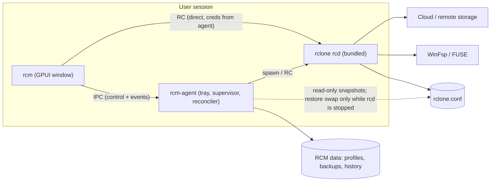

# Rclone Manager — Software Requirements & Design Specification

| | |
|---|---|
| **Document** | SRS + SDD (combined), v0.3 DRAFT |
| **Date** | 2026-10-05 |
| **Working title** | Rclone Manager ("RCM"). *Rename before launch: an unrelated Tauri-based "RClone Manager" already exists.* |
| **Targets** | Windows 10/11 (x86_64, ARM64) primary; Linux (x86_64, aarch64) secondary |
| **Stack** | Rust, GPUI (native UI), bundled `rclone`, controlled over its `rcd` HTTP API |

**Revision v0.2.** RCM no longer writes `rclone.conf`. rclone (`rcd`) is the only writer and RCM is a front end over its RC API. The custom atomic-writer / merge layer (former SW-1..5, former §7.5, the `rcm-conf` writer, former spikes S2/S3) is removed. Backups remain as read-only snapshots with a stop → swap → start restore. Rename/duplicate remote are emulated through RC (P1).

**Revision v0.3.** Added §11.1: the project is built with strict Test-Driven Development, with an explicit rule that tests must catch unexpected breakage without adding friction when new behavior is introduced.

**How to read this.** §1–3 are context and research findings. §4–5 are the requirements (testable, ID'd). §6–9 are the design. §10–13 cover delivery, testing, roadmap, and risks. Items marked **(Spike Sx)** are claims I could not confirm from documentation and that must be verified by a prototype before the design depending on them is frozen (§13).

---

## 1. Introduction

### 1.1 Purpose
Define what RCM must do and how it will be built: a desktop control plane for rclone that manages the `rclone rcd` daemon lifecycle, edits the rclone config safely, and exposes remotes, mounts, serves, and transfers through an intuitive native UI.

### 1.2 Scope
In scope: daemon supervision and autostart; bundled-rclone management and updates; remote (config) management using rclone's own interactive flow; mount and serve management with full advanced options; file browsing and transfer jobs; config backup/restore; atomic config writes; one-line installers; Windows and Linux.
RCM **never writes `rclone.conf` itself** while rcd is running: all config changes go through rclone's own `config/*` RC calls. Out of scope for v1: macOS, self-update of RCM itself (data model and interfaces reserved), multi-user/system-wide Windows service mode, cloud sync of RCM settings, telemetry.

### 1.3 Definitions
**rcd**: `rclone rcd`, rclone's remote-control daemon. **RC**: the HTTP JSON API (`POST /<group>/<method>`). **Remote**: a `[section]` of `rclone.conf`. **VFS**: rclone's virtual filesystem layer used by mount/serve. **WinFsp**: the Windows FUSE-like driver rclone mount needs. **Agent**: RCM's headless background process. **UI**: RCM's GPUI window process.

---

## 2. Research findings that shape the design

Each finding states its design consequence. Sources are listed in Appendix E.

### 2.1 rclone RC API

| # | Finding | Consequence |
|---|---|---|
| R1 | RC exposes everything RCM needs: `config/*` (create, update, delete, get, dump, listremotes, providers, unset, password, paths, setpath, unlock, oauthstatus, oauthstop), `mount/*` (mount, unmount, unmountall, listmounts, types), `serve/*` (start, stop, stopall, list, types), `sync/*` (copy, move, sync, bisync), `operations/*`, `job/*`, `core/*` (stats, transferred, bwlimit, version, pid, quit, obscure, command), `vfs/*`, `options/*`, `fscache/*`. | RCM is a **thin typed client over RC**; it does not reimplement rclone logic. |
| R2 | `config/create` / `config/update` support a **non-interactive state machine**: with `nonInteractive` rclone returns `{State, Option, Error}` for each question; the client answers with `continue=true`, `state`, `result`. `Option` uses the same schema as `config/providers`. `all=true` asks every question. Passwords are passed in clear with `continue`; defaults must be re-sent on every continue call. | "Add backends using the exact same flow as the CLI" is satisfied **by construction**: the UI renders rclone's own questions. New backends and new questions need zero UI code. |
| R3 | `config/providers` and `options/info` return option metadata: `Name, Help, Default, Examples, Required, IsPassword, Advanced, Exclusive, Type, Groups, Provider, Sensitive, Hide`. Duration/Size/enum values accept strings ("5s", "10M", "DEBUG"). | **Schema-driven form engine** (§7.3) renders any backend, VFS, mount, and global option, and stays in sync with the bundled rclone version automatically. |
| R4 | `mount/mount` takes `fs`, `mountPoint`, optional `mountType` (`mount`, `cmount`, `mount2`, …), and VFS/mount options flat (`vfs_cache_mode=full`) or nested (`vfsOpt`, `mountOpt`; nested wins). On Windows `mountPoint="*"` allocates a drive letter and returns it; UNC paths mount as a network drive. `serve/start` takes `type`, `fs`, `addr` plus flat or nested options (`vfsOpt`, `proxyOpt`, `opt`) and returns an `id`. | Profiles serialize directly to RC calls; "Copy as CLI" is a mechanical translation. |
| R5 | **Mounts and serves live inside the rcd process.** If rcd stops or crashes they vanish; rclone does not persist them. | RCM must own a **desired-state store + reconciler** (§7.6) to restore mounts/serves after restarts and logins. |
| R6 | Long calls should use `_async=true`; `job/status` is only queryable for a limited time after finish (default `--rc-job-expire-duration` 60 s). `core/stats` supports per-`group` stats. `core/transferred` returns only the last 100. `executeId` changes on every rcd restart and, with `jobid`, identifies a job across restarts. | Raise job expiry via flag; **persist job history in RCM's own DB**; invalidate cached job IDs when `executeId` changes. |
| R7 | **RC access is equivalent to shell access** as the rclone user (`core/command` re-executes the binary; backend options can shell out; `config/dump` returns credentials; no per-endpoint scopes). Default bind is loopback. With TCP, methods that touch remotes require auth unless `--rc-no-auth`. Unix sockets are supported (`--rc-addr unix:///path` or absolute path) and **bypass auth** (security = filesystem permissions). `rc/noop`, `core/stats`, `core/version`, `job/*` reads and `vfs/stats|queue|list` need no auth. | Strict local-only transport with per-session random credentials (§9). Never `--rc-no-auth`. Never bind non-loopback for RCM's own control channel. |
| R8 | Real RC security bugs shipped in 2026: CVE-2026-41176 (runtime auth bypass via `options/set`/NoAuth) and CVE-2026-41179 (`operations/fsinfo` enabling backend creation) fixed in v1.73.5; further security releases followed (v1.74.4, July 2026). | Define a **minimum rclone version floor** (≥ v1.73.5) and a **security fast lane** in the updater (§7.9). Pin the bundled version to current stable at each RCM release; re-verify at build time. |
| R9 | `core/command` can run arbitrary rclone CLI commands over RC (buffered or streamed output). `backend/command` runs backend-specific commands. | The "everything the CLI can do" guarantee: first-class UI for common operations, **generic command runner** for the long tail (§7.8). |
| R10 | `config/paths` / `config/setpath` expose and change the config path. rclone prefers an `rclone.conf` **next to the rclone executable** if one exists. | Always pass an explicit `--config`. Never place a config beside the bundled binary. |
| R11 | After changing a backend's parameters, `fscache/clear` is recommended because rcd caches constructed remotes. A running mount keeps the old backend config. | After every remote edit: `fscache/clear`; if the remote is in use, offer "restart affected mounts/serves". |
| R12 | rclone refreshes OAuth tokens at runtime and writes them back into `rclone.conf` (it reloads the file, overwrites just that key, saves). | **rcd is the single writer.** RCM never opens `rclone.conf` for writing; every change goes through `config/*` RC calls, serialised by the agent. This removes the lost-update race entirely (§7.5). |
| R13 | Config can be **encrypted** (header `# Encrypted rclone configuration File`); unlocked via prompt, `RCLONE_CONFIG_PASS`, `--password-command`, or `config/unlock`. Passwords stored in the config are *obscured* (reversible), not encrypted. Remotes may also be defined by `RCLONE_CONFIG_<NAME>_*` environment variables and appear in `config/listremotes`. | Encrypted configs work transparently because all access is via RC. Unlock with `--password-command` pointing at an RCM helper that reads the OS keyring (no secret on the command line). Treat obscured values as secrets everywhere (mask; redact in logs, diffs, exports). Env-defined remotes are read-only in the UI. Enabling/removing config encryption is done in the user's terminal (interactive `rclone config`); RCM only unlocks. |

### 2.2 Mounting

| # | Finding | Consequence |
|---|---|---|
| R14 | Windows mount requires **WinFsp** (installed separately; official Windows builds ship the `cmount` tag). Modes: fixed drive (default) vs **network drive** (`--network-mode`; drive letter required; folder mountpoints not supported). Unusual freezes in fixed mode are a documented reason to try network mode. Mount runs foreground-only on Windows. System-account mounts visible to all users need WinFsp.Launcher or a service manager. | Detect WinFsp; guide install; expose fixed/network mode as a plain-language choice. Per-user mounts only in v1. |
| R15 | Linux needs FUSE (`fusermount3`), an existing empty mountpoint, and `user_allow_other` in `/etc/fuse.conf` for `allow_other`. `mount/types` reports what this build supports; `nfsmount` availability on Windows is inconsistent between docs and field reports. | **Capabilities are discovered at runtime** (`mount/types`, `serve/types`, `rc/list`), never hard-coded. |

### 2.3 Binary management and updates

| # | Finding | Consequence |
|---|---|---|
| R16 | `rclone selfupdate` verifies the PGP-signed `SHA256SUMS` and supports `--check`, `--version`, `--stable|--beta`, and **`--output <path>`** (download without replacing the running binary). On Windows the old exe is renamed `rclone.old.exe`. | **Delegate download + verification to rclone itself** using `--output` into a versioned directory; no PGP code in RCM. |
| R17 | rclone's release signing key is **DSA** with SHA-1 signature digests; GnuPG may reject it under strict policies. | Do not build our own PGP verifier (Rust PGP DSA/SHA-1 support is a risk). In CI use `gpg` with the pinned fingerprint to verify the rclone we embed in our release **(Spike S9)**. |

### 2.4 GPUI

| # | Finding | Consequence |
|---|---|---|
| R18 | GPUI (Zed's UI framework) is consumed via crates.io snapshots (`gpui-pre-*`, e.g. `gpui-pre-windows` 0.3.3, Sep 2026) or git dependency on `zed`. The mature component layer, formerly *gpui-component*, is now **GPUI Kit** (`gpui-kit` 0.7 on crates.io, pins a matching GPUI, Apache-2.0): 75+ components, virtualized data tables, dock layout, code editor with Tree-sitter, Markdown/HTML rendering, charts, AccessKit accessibility, headless UI integration tests, CJK support. Its own docs warn APIs change frequently. | Depend on `gpui-kit` at an **exact pinned version**; budget a quarterly upgrade task; isolate GPUI behind an `rcm-ui-kit` adapter layer. Confirm crate naming/versions at project start. |
| R19 | Rendering: DirectX on Windows; **wgpu/Vulkan on Linux** (the old `blade` renderer was replaced by wgpu). Zed documents that Linux needs a Vulkan-capable GPU and otherwise falls back to a slow emulated mode; X11 and Wayland are both supported. | Linux has a hard GPU/driver prerequisite; installer checks for it and prints remediation. Provide a diagnostics screen (adapter name, backend). |
| R20 | **Upstream GPUI has no system-tray API**, and releasing the GPUI app terminates the process; forks (e.g., adabraka-gpui) add tray/daemon mode. | **Two-process architecture** (§6.1): a tiny non-GPUI `rcm-agent` owns tray, rcd, autostart; the GPUI `rcm` window opens on demand and can be closed without affecting mounts. |

### 2.5 Distribution

| # | Finding | Consequence |
|---|---|---|
| R21 | SmartScreen reputation is per file hash; new builds start with none. Microsoft's Artifact Signing (formerly Trusted Signing) is the recommended service but is region-limited (organizations: USA, Canada, EU, UK; individuals: USA, Canada), and 2026 reports show warnings recurring after certificate/intermediate rotation. OV certificates behave equivalently. | Sign everything (reduces AV/Smart App Control friction), but design the installer so SmartScreen is not the primary gate (R22). |
| R22 | Files fetched with PowerShell `Invoke-WebRequest`/`curl` generally do not receive the browser "Mark of the Web", so a `irm … | iex` installer avoids the SmartScreen download prompt. *(Widely observed behavior; verify on current Win 10/11 builds — Spike S11.)* | One-liner installer is both convenient and the lowest-friction path. Authenticode signing still required for Smart App Control and EDR. |
| R23 | rclone is frequently flagged by security tooling because it is abused for data exfiltration. | Document for enterprise users; ship hashes; allow "use existing rclone" (advanced, unsupported-ish). |

### 2.6 Competitive landscape (informational)
Existing tools: RClone Manager (Tauri/Angular, GPL-3.0; tray, mounts, serves, headless web mode), RcloneView, Rclone UI, rcloneExplorer, RcloneTray, and rclone's own embedded web GUI (`rclone gui`, new in v1.74) for basic operations. **Differentiators for RCM:** truly native, low-memory UI; transparent CLI-parity (schema-driven, "copy as CLI", "import from CLI"); safe config handling (rclone stays the only writer; automatic snapshots and one-click restore); a supervised daemon with reconciled desired state; one-line install.

---

## 3. Overall description

### 3.1 Users
- **Everyday user**: wants "my Google Drive as drive G:" in three clicks, auto-reconnecting after reboot.
- **Power user / sysadmin**: wants every flag, scripts, reproducible profiles, safe edits to a hand-maintained `rclone.conf`.
- **Homelab user (Linux)**: serves (WebDAV/SFTP/S3), systemd integration, headless-ish setups.

### 3.2 Assumptions and constraints
- rclone is the single source of truth for behavior; RCM never talks to cloud providers itself.
- `rcd` is the **only writer** of `rclone.conf`; RCM reads snapshots of it and otherwise acts as an RC front end.
- The bundled rclone version is controlled by RCM; "system rclone" is an explicit advanced opt-in.
- Per-user operation; no admin rights needed except installing WinFsp.
- GPUI/GPUI Kit APIs are unstable; Rust toolchain is pinned.
- Windows: MSVC toolchain; Linux: glibc targets (musl not viable for GPUI's graphics stack).

### 3.3 Product context diagram



---

## 4. Functional requirements

Priority: **P0** = v1 must, **P1** = v1 should, **P2** = later.

### 4.1 Daemon lifecycle (DM)

| ID | Requirement | Pri |
|---|---|---|
| DM-1 | Start, stop, restart rcd from UI, tray, and `rcmctl`. Stop is graceful (`mount/unmountall` then `core/quit`), with forced kill after timeout. | P0 |
| DM-2 | rcd is spawned with explicit `--config`, local-only transport, per-session credentials, no console window (Windows). | P0 |
| DM-3 | Health check (`rc/noop`) every 5 s; states: Stopped, Starting, Ready, Degraded, Crashed, Stopping. | P0 |
| DM-4 | Crash recovery: restart with exponential backoff (1 s → 60 s cap); crash-loop breaker (5 crashes / 2 min) surfaces last log lines and stops retrying. | P0 |
| DM-5 | On agent start, **adopt** a still-running compatible rcd (matching binary path and config path, answering with our credentials) instead of spawning a second. | P1 |
| DM-6 | Autostart at login (agent only, background, no window): Windows HKCU `Run` entry; Linux `systemd --user` unit with XDG-autostart fallback. Toggle in UI and installer flag. | P0 |
| DM-7 | Closing the UI never stops rcd. Quitting the agent from the tray stops rcd (configurable). | P0 |
| DM-8 | After rcd (re)start, reconcile desired mounts/serves (§7.6). If config is rclone-encrypted, unlock first via keyring (`config/unlock`) or prompt. | P0 |
| DM-9 | Capture rcd stdout/stderr (structured logs via `--use-json-log`) into a ring buffer and rotating files; live log viewer with level control (`options/set` LogLevel). | P0 |
| DM-10 | Single instance per user for agent and UI; second UI launch focuses the first. | P0 |
| DM-11 | Tray icon: status glyph, quick mount/unmount toggles, open UI, pause transfers, quit. Linux uses StatusNotifierItem; where unavailable (stock GNOME) the UI remains launchable and a notice explains. | P1 |

### 4.2 Bundled rclone and updates (BU)

| ID | Requirement | Pri |
|---|---|---|
| BU-1 | Ship a verified rclone in the RCM release (matching OS/arch). Keep rclone versions in side-by-side directories with a `current` pointer in state (not a symlink). | P0 |
| BU-2 | Check for new stable rclone on a schedule and on demand (`rclone selfupdate --check`); show changelog link and whether it is a security release. | P0 |
| BU-3 | Update flow: download via `selfupdate --output` into a new version dir → smoke test against an isolated temp rcd + empty config → drain (warn about active mounts/transfers) → switch → health check → **automatic rollback** on failure. Keep N previous versions (default 2). | P0 |
| BU-4 | Enforce a minimum safe version; below the floor, block autostart of rcd until updated (override with explicit consent). | P1 |
| BU-5 | Channels: stable (default), beta (opt-in), pinned version. | P1 |
| BU-6 | Optional "use my own rclone binary" with capability probe and an "unsupported" banner. | P2 |
| BU-7 | RCM self-update: **out of scope v1**, but an `UpdateSource` trait, version manifest schema and Windows replace-running-exe strategy are specified (§7.9) so it can be added without redesign. v1 users update by re-running the one-liner. | P2 |

### 4.3 Remotes / config management (CF)

| ID | Requirement | Pri |
|---|---|---|
| CF-1 | List all remotes (file + env-defined, the latter read-only) with type, status, usage (`operations/about`), and dependency badges. | P0 |
| CF-2 | **New remote wizard** driven by the non-interactive state machine (R2): backend picker from `config/providers` (searchable, with descriptions), name validation, one screen per question rendered from `Option` metadata, rclone's own advanced-config prompt, OAuth step, final summary, optional "test connection". | P0 |
| CF-3 | OAuth: run the create call asynchronously, show the auth URL (`config/oauthstatus`), open the browser, support cancel (`config/oauthstop`); headless fallback (`config_is_local=false` + paste-token flow / `rclone authorize` on another machine). | P0 |
| CF-4 | Edit remote: form pre-filled from `config/get`; basic vs advanced split from `Advanced` flag; secrets masked and unchanged unless edited; re-authenticate action; "Show all questions" mode (`all=true`). | P0 |
| CF-5 | Read-only view of a remote's stored section (from `config/get`) with secrets masked, "copy as `rclone config create` command", and a "re-run all questions" action (`all=true`). No free-text editing of the config file. | P1 |
| CF-6 | Delete remotes with a **reference check** computed from `config/dump` (crypt, alias, union, combine, chunker, compress, hasher, cache point at other remotes); block or warn accordingly. | P0 |
| CF-7 | Helpers: create a crypt remote over an existing one (password generation, `core/obscure`), union/combine/alias builders. | P1 |
| CF-8 | Config-file level: show location (`config/paths`), switch config file (`config/setpath`, then restart rcd), unlock an encrypted config, "open in external editor" (see CF-9 for picking up the change). Enabling/removing config encryption is delegated to a terminal session. | P1 |
| CF-9 | Detect external changes (file watcher + hash); refresh the view via `config/dump` without losing in-progress edits; take an `external-change` snapshot; offer "Reload" using whatever Spike S2 shows works (`config/setpath` to the same path, otherwise restart rcd). | P0 |
| CF-10 | **Duplicate** and **rename** remote, emulated through RC in the safest order: create the copy (`config/get` → `config/create`), update referencing remotes (`config/update`), verify, and only then delete the original, so every intermediate state is valid and a failure leaves the original intact. The UI states that rename is multi-step, not atomic, and that already-running mounts keep the old name until restarted. May be cut if Spike S3 shows poor fidelity. | P1 |

### 4.4 Config integrity and backups (CI, BK)

| ID | Requirement | Pri |
|---|---|---|
| CI-1 | `rcd` is the sole writer of `rclone.conf`. RCM performs no direct writes to it, except the stop → swap → start restore (BK-2) while rcd is stopped. | P0 |
| CI-2 | All config mutations pass through one agent-side **mutation queue** (one in flight), so two windows, scheduled actions or the CLI helper never interleave `config/*` calls. A multi-step wizard holds the slot until finished or cancelled (with timeout). | P0 |
| CI-3 | Each mutation is a transaction: snapshot (if content changed since the newest snapshot) → RC call(s) → verify with `config/get` / `config/listremotes` (secrets compared by presence only) → `fscache/clear` → `ConfigChanged`. On failure show rclone's error verbatim and offer to restore the pre-change snapshot. | P0 |
| CI-4 | Mutations are refused while a restore is running or rcd is not Ready. | P0 |
| CI-5 | Secrets in RC responses are masked in the UI and redacted in logs, diffs and exports. | P0 |
| BK-1 | Automatic snapshots: before a mutation (when content differs from the newest snapshot), on first run, on detected external change (rate-limited, ≤ 1 per 10 min, so rclone's own token refreshes do not spam), and on a schedule. A snapshot is a read-only copy opened with shared read/write/delete access, retried on sharing violations, and accepted only if it parses (so a mid-write read is never stored). Content-hash dedupe; retention (default: last 50 pre-mutation, 30 daily, 12 weekly). | P0 |
| BK-2 | Browse snapshots, show a **redacted diff** against the current config, and **restore** the whole file via stop → swap → start (§7.5) or selected remotes (plaintext snapshots) via `config/create` with `noObscure`. A `pre-restore` snapshot is always taken first. | P0 |
| BK-3 | Export/import a portable backup (config + RCM profiles + manifest) encrypted with a passphrase; at-rest protection for the local snapshot store. | P1 |
| BK-4 | If rcd fails to start because the config cannot be parsed or unlocked, surface rclone's error and offer restoring the latest valid snapshot. | P1 |

### 4.5 Mounts (MT)

| ID | Requirement | Pri |
|---|---|---|
| MT-1 | Mount profile: remote+path, target (free drive-letter picker, `*` auto, folder, UNC share on Windows; directory on Linux), mount type from `mount/types`, name, autostart-with-agent, retry policy. | P0 |
| MT-2 | **Presets** mapped to flag bundles with plain-language trade-offs: *Balanced*, *Streaming/media*, *Offline-first (full cache)*, *Max compatibility*, *Read-only*. Presets are editable and shown as the exact flags they set. | P0 |
| MT-3 | **Advanced panel generated from `options/info`** blocks `vfs` and `mount` (searchable, grouped, with help text, defaults and units), covering every flag RC accepts. Unknown CLI flags are kept as validated pass-through. | P0 |
| MT-4 | Windows: explain and toggle fixed vs network-drive mode; show WinFsp status with guided install; warn for invalid combos (folder mountpoint + network mode). Linux: FUSE/`fusermount3` checks, `allow_other` prerequisite hint. | P0 |
| MT-5 | Live status: mounted/mounting/error, VFS stats, upload queue (`vfs/queue`), cache usage; actions: open in file manager, refresh dir cache (`vfs/refresh`), forget (`vfs/forget`), unmount (with busy detection and an explicit advanced force option). | P0 |
| MT-6 | "Copy as CLI command" and "Import from CLI command" (parse `rclone mount …` into a profile). | P1 |
| MT-7 | Detect **unmanaged** mounts present in `mount/listmounts` and offer to adopt them. | P1 |

### 4.6 Serves (SV)

| ID | Requirement | Pri |
|---|---|---|
| SV-1 | Serve profile: remote+path, protocol from `serve/types` (http, webdav, ftp, sftp, nfs, dlna, s3, restic, docker, … as available), address/port, read-only, autostart, VFS options. | P0 |
| SV-2 | Advanced options generated from schema metadata for the chosen protocol, VFS block, auth, TLS. If rcd exposes no serve schema, fall back to a build-time generated catalog **(Spike S5)**. | P0 |
| SV-3 | Safe defaults: loopback bind. Non-loopback bind forces auth (user/pass or htpasswd) and shows a firewall note; port-conflict detection. | P0 |
| SV-4 | Show endpoint URL(s) with copy/QR; live status from `serve/list`. | P1 |

### 4.7 Other rclone capabilities (OT)

| ID | Requirement | Pri |
|---|---|---|
| OT-1 | **Explorer**: browse (`operations/list`), copy/move/rename/delete/mkdir/purge, properties, `publiclink`, size/about, hash. Virtualized table; drag between panes. | P0 |
| OT-2 | **Transfers**: sync/copy/move/bisync from saved **job profiles** with filters (`_filter`) and per-job flags (`_config`), dry-run toggle, live stats via stats groups, cancel (`job/stop*`), persistent history. Destructive operations (sync, purge, delete) require confirmation and show `--max-delete` safety. | P0 |
| OT-3 | Global bandwidth control (`core/bwlimit`) and bwlimit timetables. | P1 |
| OT-4 | Check/verify (`operations/check`), duplicates (`dedupe` via command runner), cleanup, settier. | P1 |
| OT-5 | **Command runner** (R9): form-per-command from a generated catalog, live streamed output, "copy as CLI". Interactive TUI commands (`ncdu`, interactive `config`) open in the user's terminal. | P1 |
| OT-6 | Job scheduling in the agent (cron-style), run-missed-on-wake policy, notifications. | P2 |
| OT-7 | Metrics panel (optionally Prometheus endpoint). | P2 |

### 4.8 Installation (IN)

| ID | Requirement | Pri |
|---|---|---|
| IN-1 | Windows: `irm https://<host>/install.ps1 \| iex`. Linux: `curl -fsSL https://<host>/install.sh \| sh`. | P0 |
| IN-2 | Per-user install, no admin; checksum + signature verification; idempotent upgrade; Start Menu/desktop entry; uninstall entry; flags for version, autostart, PATH, no-WinFsp-prompt, purge on uninstall. | P0 |
| IN-3 | Prerequisite checks with actionable messages: WinFsp (Windows), `fusermount3` and Vulkan loader (Linux). | P0 |

### 4.9 Settings and UX (UX)

| ID | Requirement | Pri |
|---|---|---|
| UX-1 | Dashboard with daemon state, active mounts/serves, running jobs, recent errors. | P0 |
| UX-2 | Command palette (Ctrl/Cmd+K), full keyboard navigation, light/dark following system. | P1 |
| UX-3 | Every secret field masked by default with explicit reveal; secrets never in logs or diagnostics. | P0 |
| UX-4 | Diagnostics export (redacted): versions, capabilities, GPU adapter, recent logs, redacted config structure. | P1 |
| UX-5 | Localization-ready string layer (English only in v1). | P2 |

---

## 5. Non-functional requirements

| ID | Requirement | Target |
|---|---|---|
| NF-1 | Agent idle memory (excluding rclone) | ≲ 30 MB RSS; no GPU libs initialized |
| NF-2 | UI cold start to interactive | ≲ 1.5 s on mid-range hardware |
| NF-3 | UI frame rate during list scroll (10k rows) | 60 fps minimum, 120 fps where display allows |
| NF-4 | Config integrity | RCM performs no config writes while rcd runs; every mutation is preceded by a snapshot when content changed; the restore swap runs only with rcd stopped and is tested with kill failpoints (file is always old-or-new, never partial) |
| NF-5 | Recovery | Mounts/serves re-established ≤ 15 s after rcd restart (excluding network latency) |
| NF-6 | Security | Threat model §9 satisfied; no listening port reachable off-host |
| NF-7 | Compatibility | Windows 10 22H2+, 11; Ubuntu 22.04+, Fedora current, Arch; X11 and Wayland |
| NF-8 | Accessibility | Keyboard-complete; AccessKit roles/names on all controls; screen-reader smoke test per release **(Spike S1)** |
| NF-9 | Privacy | No telemetry, no network calls except rclone update checks and user-initiated actions |
| NF-10 | Maintainability | Compile-time isolation of GPUI; strict TDD per §11.1 (tests pin behavior, not implementation); ≥ 80% unit coverage in non-UI crates; crate dependency direction enforced in CI; `cargo-deny`/`audit` gating |

---

## 6. System architecture

### 6.1 Process model (key decision)

| Process | Binary | Responsibility | Links GPUI? |
|---|---|---|---|
| **Agent** | `rcm-agent` | tray, rcd supervision, autostart, desired-state reconciler, config mutation queue, backup/snapshot scheduler, job scheduler, event hub, IPC server | No |
| **UI** | `rcm` | GPUI window(s); talks to agent (control/events) and directly to rcd (data calls) | Yes |
| **rcd** | `rclone` | all rclone work | n/a |
| **Helper CLI** | `rcmctl` | status/start/stop, `print-config-pass` (used as rclone `--password-command`), scripting | No |

**Why two processes:** upstream GPUI cannot host a tray and exits when its app handle drops (R20); mounts must survive UI closure; the agent stays tiny and crash-isolated from graphics-driver faults.

**Why the UI calls rcd directly for data:** avoids proxying every list/stat through IPC. The agent hands the UI connection info through the authenticated local IPC channel; the control plane (lifecycle, desired state, events) stays in the agent.

### 6.2 Cargo workspace

| Crate | Role |
|---|---|
| `rcm-core` | domain types (Remote, MountProfile, ServeProfile, JobProfile), errors, ids |
| `rcm-rc` | async RC client (reqwest/rustls, unix-socket transport), typed endpoints for ~45 calls + generic `call()`, error mapping, `OptionSchema`, **wizard driver** |
| `rcm-config` | read-only INI parser (snapshots, diffs), reference graph from `config/dump`, snapshot store, stop → swap → start restore, external-change watcher |
| `rcm-supervisor` | process spawn/adopt, health state machine, log capture, binary manager, reconciler |
| `rcm-platform` | OS specifics: paths, WinFsp/FUSE detection, drive letters, Job Objects, autostart, keyring, browser open, file manager open, DPAPI |
| `rcm-ipc` | agent↔UI protocol (versioned JSON-RPC over local sockets / named pipes), event stream |
| `rcm-agent`, `rcm-cli` | binaries |
| `rcm-ui-kit` | thin adapter over `gpui-kit` (buttons, forms, tables, theme tokens) |
| `rcm-ui` | binary: views, view-models, schema-form renderer |
| `rcm-xtask` | codegen (command/serve catalogs), packaging, release |

Key crates (versions pinned at start; verify current): `tokio`, `reqwest` (rustls), `serde`/`serde_json`, `toml_edit`, `rusqlite`, `tracing`, `thiserror`, `clap`, `interprocess` (local sockets/named pipes, tokio), `notify`, `fs4` (locks), `keyring`, `windows` (Win32), `tray-icon` or `ksni`, `age`, `sha2`, `semver`, `zeroize`, `open`, `directories`, `camino`.

### 6.3 Runtime dataflow (create remote)

1. UI → `rcm-rc`: `config/create {name,type,parameters:{}, opt:{nonInteractive:true}}` (async job).
2. rclone replies `{State, Option, Error}`; wizard driver emits a **Question** view-model.
3. UI renders the question from `Option`; user answers; driver calls `config/update {name, opt:{continue:true,state,result}, parameters:{…defaults}}`.
4. Loop until `State == ""`. For OAuth the call blocks server-side: UI polls `config/oauthstatus`, shows URL, offers cancel.
5. Config Service: snapshot before the first mutation; after completion `fscache/clear`; file watcher refreshes the model.

---

## 7. Detailed design

### 7.1 Agent and supervisor

**State machine** `Stopped → Starting → Ready ⇄ Degraded → Stopping → Stopped`; `Crashed` loops to `Starting` with backoff; breaker after 5 crashes/2 min → `Failed(needs attention)`.

**Spawn parameters** (illustrative):
```
rclone rcd --config <path> --rc-addr <transport> --rc-job-expire-duration 1h
           --use-json-log --log-level NOTICE
env: RCLONE_RC_USER=<rand>, RCLONE_RC_PASS=<rand 256-bit>
     [--password-command "<rcmctl> print-config-pass"] when config is encrypted
```
- **Transport:** Linux → Unix socket in `$XDG_RUNTIME_DIR/rcm/rcd.sock` (0600). Windows → `127.0.0.1:<free port>` with per-session credentials; AF_UNIX on Windows is an alternative but Rust async support is limited **(Spike S6)**. Credentials go via environment variables, not argv, so they are absent from process listings.
- **Port selection:** probe a free port, spawn, retry on bind failure (parsing log output for a chosen port is fragile).
- **Windows specifics:** `CREATE_NO_WINDOW`, new process group; agent and UI use the `windows` subsystem (no console flash). rcd is deliberately *not* in a kill-on-close Job Object so the agent can be restarted and adopt it (DM-5); orphan prevention relies on adoption plus a PID/start-time record.
- **Adoption:** read `state/rcd.json` (pid, start time, exe path, config path, transport); probe; accept only if credentials authenticate and `core/version` + `config/paths` match.
- **Graceful stop:** `mount/unmountall` → `core/quit` → wait 10 s → terminate. (No SIGTERM on Windows.)
- **Health:** `rc/noop` (no auth needed) every 5 s; `core/pid` + `executeId` recorded; a changed `executeId` broadcasts `RcdRestarted` so UIs drop stale job ids.

### 7.2 RC client (`rcm-rc`)
- `call<T>(path, params) -> Result<T, RcError>`; `RcError{status, error, input, path}` parsed from the documented error body; classification into transient / permanent / auth.
- Typed wrappers for core flows; everything else through the generic call so new RC methods are usable day one.
- Feature detection: `rc/list` + `core/version` at connect; UI hides what the bundled build lacks.
- Async jobs: helper that starts with `_async=true`, tracks `(executeId, jobid)`, polls `job/status` before expiry, mirrors into history DB. Per-job `_group` for stats.
- Timeouts: short for control calls; none for streaming; cancellation via `job/stop`.
- Zeroize password-bearing request bodies after send (best effort).

### 7.3 Schema-driven form engine (central to "intuitive but complete")
Input: `Option` blocks from `config/providers`, `options/info`, and wizard questions. Output: GPUI form view-models.

| Option field | UI mapping |
|---|---|
| `Type` bool | toggle |
| `Exclusive` + `Examples` | dropdown/segmented control with per-example help |
| `Examples` (non-exclusive) | combo box (free text + suggestions) |
| `Type` int/float/`SizeSuffix`/`Duration`/`BandwidthSpec` | validated numeric field with unit selector; stores rclone's string form |
| `IsPassword`/`Sensitive` | masked input, reveal toggle, zeroized buffer, never logged |
| `Required` | required marker + validation |
| `Advanced` | collapsed "Advanced" group |
| `Groups` | section grouping inside Advanced; free-text search across names + help |
| `Provider` | shown only when the selected provider (e.g., S3 flavor) matches |
| `Hide` | hidden unless "show all" |
| `Help` | first line as inline hint; rest in a help popover; URLs clickable |

Help text is hard-wrapped at 80 columns by rclone; the renderer re-flows it. Unknown `Type` strings degrade to a text field plus the default shown, so a newer rclone never breaks the UI.

### 7.4 Wizard driver (CLI-identical flow)
A pure state machine in `rcm-rc`, UI-agnostic and unit-testable with recorded transcripts:
```
Start(name,type,preset params) → Ask(Question) ⇄ Answer(value)
                              → Waiting(OAuth{url}) → Done | Error(msg, retry?)
```
Rules from the rclone docs: send answer as `result`, echo `state`; on `Error` show it with the question; re-send default parameters on every continue; passwords in clear; use `obscure`/`noObscure` flags when ambiguity is possible (22+ char base64-looking passwords). Transcripts from real rclone runs are recorded per backend as golden tests (drive, s3, sftp, crypt, onedrive, webdav, local).

### 7.5 Config management and backups, RC-only (`rcm-config`)

**Principle.** rclone owns `rclone.conf`. RCM is a client of `config/*`; the file is never opened for writing during normal operation. The UI model comes from `config/dump`, `config/listremotes` and `config/providers`, not from parsing the file. The only file parser is a small read-only one used for snapshots and diffs.

**Mutation pipeline (agent-side, serialised)**
1. A UI sends a mutation intent (create / update / delete / unset / password / …).
2. The queue admits one at a time and rejects if rcd is not Ready or a restore is running.
3. Snapshot if the file hash differs from the newest snapshot.
4. Execute the RC call(s). A wizard is many requests but one logical mutation; the slot is held until Done or Cancel (with timeout, since OAuth may wait on a human).
5. Verify via `config/get` (expected keys present; secrets by presence only) or `config/listremotes` (after delete).
6. `fscache/clear`; flag dependent mounts/serves "restart recommended"; broadcast `ConfigChanged`.

On failure the error is shown unchanged and a "Restore pre-change snapshot" action is offered.

**Reference graph.** Built from `config/dump`: values of `remote` (crypt, alias, chunker, compress, hasher, cache) and `upstreams` (union, combine) that contain `name:`. Drives delete warnings, rename/duplicate (CF-10) and dependency badges. Windows note: single-letter remote names collide with drive letters; the name validator warns.

**Rename/duplicate emulation (CF-10).**
1. `config/get` the source section.
2. `config/create` the new name with the same type and parameters, `noObscure=true`, non-interactive, so no questions are asked.
3. For each referrer found in the graph, `config/update` its reference to the new name.
4. Verify with `config/get` / `config/dump` (secrets by presence).
5. Rename only: `config/delete` the old name. RCM's own profiles that point at the old name are rewritten in RCM's store in the same logical operation.

Limits: not atomic across calls (ordering keeps every intermediate state valid); env-defined remotes cannot be renamed; running mounts keep the old backend until restarted; fidelity of OAuth token JSON and obscured passwords through get → create is verified by Spike S3.

**External changes.** A file watcher (notify + content hash, debounced; RCM's own mutation windows ignored) takes an `external-change` snapshot, refreshes the model via `config/dump`, and shows a toast. Whether a running rcd sees external edits is Spike S2; the "Reload" action uses `config/setpath` to the same path, otherwise restarts rcd.

**Backup store** (`%LOCALAPPDATA%\RCM\backups`, `~/.local/share/rcm/backups`):
- File `rclone.conf.<UTC-timestamp>.<reason>.<hash8>` plus `index.json` (reason, size, remote names, source: rcm | external, app version).
- Reasons: `pre-mutation`, `scheduled`, `manual`, `pre-restore`, `external-change`, `first-run`.
- Dedupe by content hash; retention per BK-1; directory ACL restricted to the user; optional at-rest encryption (Windows DPAPI-bound, or `age` with a keyring-held key).
- Snapshots of an encrypted config are ciphertext (no diff, whole-file restore only, and the config password must still be valid); the password is never part of a backup.

**Restore (whole file): stop → swap → start**
1. Take a `pre-restore` snapshot.
2. Pause the reconciler; `mount/unmountall`, `serve/stopall`, `core/quit`; wait for the process to exit (terminate after timeout).
3. Write the chosen snapshot to a temp file in the config directory, flush, replace the config (Windows `MoveFileExW` with replace-existing and write-through; Linux `rename` then `fsync` of the parent directory). With no running writer, a plain atomic replace is sufficient.
4. Start rcd (unlock if encrypted); verify with `config/listremotes`. On failure, swap back to the `pre-restore` snapshot the same way.
5. Resume the reconciler.

**Selective restore** (plaintext snapshots only): choose remotes, then `config/create` / `config/update` with `noObscure`, followed by `fscache/clear`.

### 7.6 Desired-state store and reconciler
Profiles live in RCM's own data (not inside `rclone.conf`, which rclone parses as backend options).

```
desired = profiles where enabled && autostart (or manually started this session)
actual  = mount/listmounts ∪ serve/list
loop on: RcdReady | ProfileChanged | ConfigChanged | timer(30s)
  for p in desired − actual: start(p)          # dependency order: crypt/alias targets first
  for a in actual − desired: mark "unmanaged"  # never auto-unmount; offer adopt/stop
  for p in desired ∩ actual: compare effective params → "drifted" badge → offer restart
```
- Normalize mountpoints (case-insensitive drive letters on Windows, trailing slash).
- Error classes: *permanent* (bad option, mountpoint exists, WinFsp missing) → stop retrying, show actionable error; *transient* (network, auth refresh) → exponential backoff with jitter, cap 5 min.
- Editing a remote or profile in use → "restart affected mounts?" (R11).
- Start order and staggering avoid a thundering herd of simultaneous mounts at login.

### 7.7 Mount and serve specifics

**Profile → RC.** `mount/mount {fs, mountPoint, mountType, <flat flags>}` with `*` for auto drive letter (record the returned letter as runtime state, not as the profile's value unless the user pinned one). Serve: `serve/start {type, fs, addr, <flat flags>}` → store returned `id` as runtime state.

**Presets** (editable, always displayed as concrete flags; illustrative):

| Preset | Intent | Typical flags |
|---|---|---|
| Balanced | everyday use | `vfs_cache_mode=writes`, moderate `dir_cache_time` |
| Streaming | media playback | `vfs_cache_mode=full`, larger `vfs_read_ahead`/buffer, limited cache age |
| Offline-first | work through disconnects | `vfs_cache_mode=full`, large `vfs_cache_max_size`, long `vfs_cache_max_age` |
| Max compatibility | picky apps | `vfs_cache_mode=full`, `no_checksum`/`no_modtime` as needed, network mode (Windows) |
| Read-only | safety | `read_only=true` |

**Validation before start:** mountpoint exists/empty (Linux) or free/valid (Windows); WinFsp or FUSE present; type available in `mount/types`; port free (serves); non-loopback bind has auth. Windows UNC/network-share mode requires a drive letter semantic as documented; the UI hides impossible combos instead of failing later.

**Unmount:** `mount/unmount`; on "busy" show holding processes where discoverable; forced/lazy unmount (`fusermount3 -uz`) only behind an explicit advanced action.

### 7.8 "Everything the CLI can do"
Three tiers, with the CLI→RC map in Appendix A:
1. **First-class UI** over native RC endpoints (config, mount, serve, sync, explorer, checks, bwlimit, stats).
2. **Generic command runner** over `core/command`/`backend/command` for the long tail, with a **build-time generated command catalog** (`rcm-xtask` parses the pinned rclone's documented flags into JSON: commands, flags, types, help) so the runner renders forms. Streamed stdout/stderr. TUI commands open an external terminal.
3. **Transparency:** every operation offers "Copy as CLI", every profile can export as `.ps1`/`.sh`/systemd unit, and mount/serve profiles can be created by pasting an existing CLI line (flag names map 1:1 to `options/info` names).

### 7.9 Binary manager and updates
Layout:
```
<data>/rclone/<version>/rclone[.exe]       # immutable versions
<data>/state/binary.json                   # { current, previous[], channel, pinned }
```
Update transaction: `selfupdate --check` → `selfupdate --version X --output <data>/rclone/X/rclone` (rclone verifies signature+hash) → smoke test (run isolated `rcd` on a temp socket/port with an empty temp config, call `rc/noop` and `core/version`) → warn if mounts/transfers active → graceful stop → flip `current` → start → health check ≤ 30 s → commit, else roll back to `previous` and mark the version bad.
**Security fast lane:** version < floor ⇒ persistent banner, tray badge, autostart gated (BU-4). **Release embedding in CI:** download rclone for each target, verify `SHA256SUMS` signature with `gpg` against the pinned fingerprint, then bundle (Spike S9).
**RCM self-update (reserved):** `UpdateSource` trait; manifest `latest.json {version, assets[{os,arch,url,sha256,sig}], min_agent_version}` signed with ed25519 (minisign format); Windows replacement via staged copy + rename-on-exit helper (same pattern as `rclone.old.exe`); not shipped in v1.

### 7.10 Autostart
- **Windows (default):** `HKCU\Software\Microsoft\Windows\CurrentVersion\Run` → `rcm-agent.exe --background`. Per-user, no admin, shown in Settings → Apps → Startup. Optional later: Task Scheduler logon task (delay, restart on failure). *Not* a Windows service in v1: services run in session 0 and their mounts are invisible to the user's session unless WinFsp.Launcher is used.
- **Linux:** `~/.config/systemd/user/rcm-agent.service` (`Restart=on-failure`, `WantedBy=default.target`), enabled via `systemctl --user enable --now`; fallback `~/.config/autostart/rcm-agent.desktop` where no user systemd. Optional "start before login" via `loginctl enable-linger` with explanation.

### 7.11 UI design (GPUI)

**Information architecture:** Sidebar → Dashboard · Remotes · Mounts · Serves · Transfers · Explorer · Tools · Backups · Settings (Daemon, rclone version, Startup, Logs, Appearance, Advanced).

```
┌ title bar ────────────────────────────────────────────────────────────┐
│ ● rclone 1.74.x ready    mounts 3  serves 1  jobs 0        [Ctrl+K]   │
├────────┬──────────────────────────────────────────────────────────────┤
│Dashboard│  Mounts                                    [+ New mount]     │
│Remotes  │  ┌──────────────────────────────────────────────────────┐   │
│Mounts ◀ │  │ G:  gdrive:/Media     ● mounted   Streaming   ⋯      │   │
│Serves   │  │ H:  s3:backup         ○ stopped   Balanced    ⋯      │   │
│Transfers│  └──────────────────────────────────────────────────────┘   │
│Explorer │  ▸ Details: VFS cache 1.2 GB · uploads queued 0 · errors 0   │
│Tools    │  [Open] [Unmount] [Restart] [Copy as CLI]                    │
│Backups  │                                                              │
│Settings │                                                              │
└────────┴──────────────────────────────────────────────────────────────┘
```

**Patterns:** master/detail lists; "Basic ⇄ Advanced" disclosure on every form; presets before flags; inline validation; destructive actions use confirmation with the exact consequence; every error shows cause + next action + "copy details".

**State management:** one GPUI `Entity` per domain store (`DaemonStore`, `RemotesStore`, `MountsStore`, `ServesStore`, `JobsStore`, `BackupsStore`); views are pure functions of store state. Async work: a dedicated multi-thread `tokio` runtime hosts `rcm-rc`/`rcm-ipc`; results cross into GPUI via channels awaited in `cx.spawn`. Agent events (`DaemonState`, `ConfigChanged`, `MountStateChanged`, `JobProgress`) update stores.

**Lists:** virtualized tables for explorer, history, logs. **Editing:** GPUI Kit's code editor widget for the raw-section editor and log viewer. **Theming:** semantic tokens following system light/dark; high-DPI aware; honor reduced-motion.

**Accessibility/IME:** AccessKit roles and names on every control, tab order tested, CJK input verified (Spike S1).

### 7.12 Secrets
- OS keyring (`keyring`: Credential Manager / Secret Service) for the rclone config password and serve credentials; headless Linux without a secret service falls back to prompt-per-session.
- `rcmctl print-config-pass` reads the keyring and is invoked by rclone as `--password-command`.
- In-memory secrets in `Zeroizing<String>`; GPUI text buffers are best-effort. Logs pass through a redactor keyed on `Sensitive`/`IsPassword` option names and known token patterns.

### 7.13 Logging and diagnostics
`tracing` JSON logs with rotation; separate streams for agent, UI, rcd. Live viewer with level filter and text search; rcd log level changes at runtime. Diagnostics bundle (UX-4) is redacted by construction.

### 7.14 IPC (agent ↔ UI)
JSON-RPC 2.0 over local sockets (Windows named pipe with a user-only DACL; Linux Unix socket 0600 in `$XDG_RUNTIME_DIR`). Handshake `{protocol_version, app_version}`; methods: `daemon.start|stop|restart|status`, `rc.connection_info` (returns transport + credentials to the authenticated UI), `profiles.*`, `reconcile.now`, `backups.*`, `settings.*`; server-push events. Backward compatibility: additive changes only within a major protocol version; the UI offers to restart a mismatched agent.

---

## 8. Data and on-disk layout

| Item | Windows | Linux |
|---|---|---|
| Install dir | `%LOCALAPPDATA%\Programs\RCM\` (`rcm.exe`, `rcm-agent.exe`, `rcmctl.exe`) | `~/.local/share/rcm/app/` + symlinks in `~/.local/bin` |
| rclone versions | `%LOCALAPPDATA%\RCM\rclone\<ver>\` | `~/.local/share/rcm/rclone/<ver>/` |
| Settings & profiles (TOML, versioned, atomic writes) | `%APPDATA%\RCM\` | `~/.config/rcm/` |
| History DB (SQLite), logs, backups, state | `%LOCALAPPDATA%\RCM\` | `~/.local/share/rcm/`, `~/.local/state/rcm/` |
| rclone config (default, user-overridable) | `%APPDATA%\rclone\rclone.conf` | `~/.config/rclone/rclone.conf` |
| Runtime sockets/pids | named pipe / `state\` | `$XDG_RUNTIME_DIR/rcm/` |

Profiles are schema-versioned with forward migrations; unknown keys preserved. Backups and logs are *not* in the roaming profile.

---

## 9. Security design

**Assets:** cloud credentials/tokens in `rclone.conf`, the RC channel (shell-equivalent, R7), backups, installer/update chain.

| Threat | Mitigation |
|---|---|
| Local process or other user hits RC | Unix socket 0600 (Linux); loopback + per-session random credentials via env (Windows); never `--rc-no-auth`; no non-loopback bind for the control channel; IPC pipe DACL user-only |
| Browser/DNS-rebinding against loopback RC | auth always required for remote-touching methods; no `--rc-allow-origin`; credentials not guessable |
| Credential leakage via argv/env dumps/logs | env not argv; `--password-command` for config password; redaction; no secrets in diagnostics |
| Obscured ≠ encrypted passwords | treated as secrets; masked; backups protected (ACL, optional encryption) |
| Corrupt or lost config | rclone is the sole writer; mutations serialised; snapshot before every change; restore via stop → swap → start; snapshot store access-restricted |
| Vulnerable rclone | minimum-version floor, security fast lane, signature-verified updates (R8, R16) |
| Supply chain (installer, releases) | HTTPS, SHA-256 + detached signature on manifest, signed binaries, SBOM, pinned rclone PGP fingerprint in CI, reproducible-as-possible builds |
| DLL hijack / PATH issues | absolute paths for spawned binaries; install dir user-writable only; WinFsp located via registry, not PATH |
| Over-broad serves | loopback default; forced auth on LAN bind; visible "exposed" badge |
| `core/command` misuse | UI-only; arguments built from catalog; no untrusted input interpolation |

---

## 10. Build, distribution, and installer

**Toolchain.** Pinned stable Rust (edition per GPUI Kit's requirement), MSVC target with static CRT on Windows, Windows SDK; Linux dev packages for X11/Wayland/xkbcommon/Vulkan/DBus. Targets: `x86_64-pc-windows-msvc`, `aarch64-pc-windows-msvc`, `x86_64-unknown-linux-gnu`, `aarch64-unknown-linux-gnu`.

**CI (GitHub Actions).** Build matrix → `cargo-deny`/`cargo-audit` → tests (§11) → fetch + gpg-verify rclone → package → **sign** (Authenticode via Artifact Signing if eligible, otherwise OV certificate) → `SHA256SUMS`, minisign signature over `latest.json`, SBOM (CycloneDX) → release assets.

**Windows one-liner (`install.ps1`) steps:** require PowerShell 5.1+/TLS 1.2; detect arch; fetch `latest.json` (+ signature) and the zip; verify SHA-256 (and signature if `minisign` is available or via a built-in verifier); extract to `%LOCALAPPDATA%\Programs\RCM`; Start Menu shortcut; HKCU uninstall entry; optional PATH and autostart; WinFsp check (registry) with offer to run `winget install WinFsp.WinFsp` or open the official download (WinFsp is not bundled; its GPLv3-with-FLOSS-exception licensing is a reason to keep it a user-installed prerequisite); idempotent upgrade; stop agent before replacing files. Parameters via script block:
```powershell
& ([scriptblock]::Create((irm https://<host>/install.ps1))) -Version 1.0.0 -Autostart -NoWinFsp
```
**Linux one-liner (`install.sh`):** wrapped as `main() { … }; main "$@"` so a truncated download cannot execute partially; POSIX `sh`; detect arch/distro; verify checksum (and minisign signature when available); install to `~/.local/share/rcm`, link `~/.local/bin`; write `.desktop` + icon; check `fusermount3`, Vulkan loader (`vulkaninfo` if present) and print remediation; optional `systemd --user` enablement; `--uninstall [--purge]`.
Both scripts: print what they will do first, `--dry-run`, never touch `rclone.conf` on uninstall unless `--purge` and explicit confirmation.

**Windows signing/SmartScreen reality (R21):** expect reputation to build per file; the one-liner avoids the browser download prompt (R22) but signing remains mandatory for Smart App Control and enterprise EDR.

---

## 11. Testing strategy

### 11.1 Development methodology: strict TDD

RCM is developed with **strict Test-Driven Development**: no production behavior is written without a failing test that demands it. The purpose and limits of the tests are part of this specification:

> **Testing is to ensure our changes don't break things. Testing is to ensure that one change does not cause unexpected behavior elsewhere.** Tests must not lock in implementation, and must not become friction when building a new feature. A new feature is a new requirement, a new specification, a whole new behavior; some red failing tests are expected while it is built. **What we watch for are unexpected failing tests.** If a change to one component breaks something in another component, that is an architectural mistake or an implementation issue, and that is where we start tracking down problems.

**Rules**

1. **Red → green → refactor, test first.** Every behavior starts as a failing test. Bug fixes start with a test that reproduces the bug.
2. **Tests pin behavior, not implementation.** Assertions target public boundaries: a crate's public API, the RC contract, the IPC protocol, view-model output. Tests do not assert on private functions, internal data structures, or call order. Prefer fakes and real rclone over mocks of our own internals. *Acceptance test for this rule:* an internal refactor that preserves behavior requires zero test edits.
3. **New behavior means expected red.** When a requirement is added or changed (IDs in §4), write its failing tests first. Those reds are normal and are not a problem. If the new spec intentionally changes old behavior, update the old tests deliberately in the same commit, citing the requirement ID, instead of bending the design to keep outdated tests green.
4. **Unexpected red is the signal.** A failing test that the current change was not meant to affect stops feature work until triaged:
   - *Test was coupled to implementation* → the test is wrong; rewrite it to pin behavior (a test smell, fixed at the source).
   - *Genuine regression* → fix the code.
   - *A change in component A broke component B across a boundary* → treat this as an **architecture defect**, not a test problem. Fix the boundary (interface, ownership, hidden shared state, leaked type), not just the symptom.
5. **Never silence an unexpected red** by loosening, deleting, or `#[ignore]`-ing a test without understanding why it failed.
6. **Tests must not add friction.** Fast, deterministic, no sleeps, no order dependence, no shared global state. Unit tests per crate run in seconds; slower tiers (real rclone, WinFsp/FUSE mounts, GPUI headless windows, installers) are separate CI stages, and developers run only the tiers relevant to their change locally.
7. **Expected reds are declared, unexpected reds are loud.** Main is always green. On a feature branch, intentionally failing tests are listed in a small checked-in `expected-red.toml` (test name → requirement ID). CI runs a dedicated job that fails on any failing test **not** in that list ("unexpected red") and also fails if the list is non-empty at merge time. This makes expected reds visible but harmless, and unexpected ones impossible to miss.
8. **Architecture is tested too.** Crate dependency direction is enforced in CI (`cargo metadata` check plus `cargo-deny` bans): `rcm-core` depends on nothing internal; non-UI crates never depend on GPUI; `rcm-ui` never talks to the OS directly. If a change in crate X turns tests in an unrelated crate Y red, that is filed as an architecture issue and tracked.
9. **Spikes are not production code.** Exploratory spikes (§13.1) are throwaway. Each finding is captured as a characterization test (for example a recorded RC transcript) before production code relies on it.
10. **Traceability.** Test names or attributes reference requirement IDs (e.g. `mt_2_*`, `cf_10_*`). Every §4 requirement has at least one test; untested requirements are visible in CI output.

**Where TDD drives design in this project**

| Area | Test-first focus |
|---|---|
| Wizard driver (§7.4) | pure state machine tested with recorded real-rclone transcripts; no network, no UI |
| Reconciler (§7.6) | table-driven desired-vs-actual scenarios with a fake RC; asserts resulting RC calls and states, not internals |
| Supervisor (§7.1) | state machine with a fake process/clock; crash-loop breaker, adoption, backoff |
| Form engine (§7.3) | option metadata in, view-model out; unknown types degrade gracefully |
| Mutation queue / restore (§7.5) | behavior under injected failures at each step; invariants "file is old-or-new" and "no mutation while restoring" |
| `rcm-rc` | contract tests against recorded transcripts and a live pinned rclone in CI |
| UI | view-model and headless GPUI interaction tests; pixel/screenshot tests only as smoke checks |

**Definition of done for any change:** new behavior has tests tied to requirement IDs; no unexpected red; any edited or deleted existing test is explained in the change description by a requirement change, not by convenience.

### 11.2 Test layers

| Layer | Approach |
|---|---|
| Unit | pure logic: schema→form mapping, wizard driver with recorded transcripts, reconciler decisions, retention policy, reference graph |
| Property/fuzz | read-only INI parser against real snapshots; reference-graph extraction; mountpoint normalization |
| **Differential vs real rclone** | wizard transcripts replayed against the pinned rclone for several backends (including network-free: `local`, `memory`, `crypt`, `alias`, `union`); rename/duplicate emulation checked by `config/dump` equality before/after |
| Integration | real `rclone rcd` in CI: lifecycle, crash/adopt, async jobs, serve start/stop; Windows runner with WinFsp installed for real mounts; Linux container with `/dev/fuse` |
| Failure injection | kill rcd/agent at each step of the mutation pipeline and of the restore swap (file is always old or new; reconciler recovers); snapshot reads during a concurrent rclone token-refresh write; locked-file (sharing violation) simulation |
| UI | GPUI/GPUI Kit headless integration tests (pointer, keyboard, focus, accessibility assertions); smoke screenshots on Windows/Linux |
| Installer | fresh Windows 10/11 VMs/Sandbox, Ubuntu/Fedora/Arch containers + desktop VMs; `PSScriptAnalyzer`, `shellcheck`; idempotency, upgrade, uninstall |
| Soak | 24 h mount/unmount cycles; rcd kill loops; agent kill -9 + adoption; sleep/resume |
| Matrix | Win10 22H2, Win11 (x86_64/ARM64), Ubuntu 22.04/24.04 (X11+Wayland), Fedora, Arch, GPU-less VM (expected-failure path with good message) |

---

## 12. Roadmap (relative sizing: S ≈ days, M ≈ 1–2 weeks, L ≈ 3–6 weeks, XL > 6 weeks for one engineer)

| Milestone | Content | Size |
|---|---|---|
| **M0 Spikes** | S1–S11 (§13); decide transport, tray, GPUI Kit version, schema coverage | M |
| **M1 Foundation** | workspace, `rcm-rc`, supervisor, agent, IPC, health/log capture, binary layout, **test harness** (fake RC server, pinned-rclone fixtures, transcript recorder, `expected-red.toml` CI job, dependency-direction check) | L |
| **M2 Config** | schema form engine, wizard driver, remotes UI (RC-only), mutation queue, snapshots/restore, rename/duplicate emulation | L |
| **M3 Mounts** | profiles, presets, advanced panel, WinFsp/FUSE checks, reconciler, tray | L |
| **M4 Serves** | profiles, schema/fallback catalog, safety defaults | M |
| **M5 Everything else** | explorer, transfers/jobs, command runner + catalog, bwlimit, checks | XL |
| **M6 Ship** | one-liners, signing, rclone updater + rollback, autostart, docs | L |
| **M7 Hardening** | soak, accessibility pass, enterprise/AV guidance, beta program | M |

MVP cut for a first public beta: M0–M3 + minimal M6 (installer, autostart, rclone update with rollback).

---

## 13. Risks and spikes

### 13.1 Spikes (verify before freezing the dependent design)

| Id | Question | Fallback |
|---|---|---|
| S1 | GPUI Kit on Win10/11 (x86_64 + ARM64), high-DPI, IME/CJK, AccessKit with Narrator/NVDA, GPU-less behavior (software rasterizer) | Raise min specs; invest in a documented "no GPU" message; evaluate upstream git rev vs `gpui-kit` |
| S2 | After an external edit or replace of `rclone.conf`, does a running rcd see it? Does rclone's own writer use temp-file + rename (affects durability wording)? | Reload via `config/setpath` to the same path, or restart rcd; word durability claims conservatively |
| S3 | Rename/duplicate emulation: does `config/get` → `config/create` (`noObscure`, non-interactive) round-trip every key type (OAuth token JSON, obscured passwords, crypt) unchanged, and does `config/update` on referrers behave? | Ship duplicate only, or instruct the user to rename in a terminal |
| S4 | Async `config/create` with OAuth: blocking behavior, `oauthstatus`/`oauthstop` cancellation, headless paste-token flow | Spawn `rclone authorize` helper for token step |
| S5 | Do `options/info` blocks cover each `serve` type's options? | Build-time catalog from pinned rclone docs |
| S6 | Windows transport: AF_UNIX from Rust async vs loopback TCP + auth | Loopback TCP (default plan) |
| S7 | Tray: `tray-icon` vs `ksni`; agent event-loop design; GNOME-without-extension behavior | Window-only mode with clear notice |
| S8 | Windows mount behavior: `*` allocation, network vs fixed mode, rcd kill leaves stale drive?, Explorer hangs, unmount busy | Defaults to network mode where fixed misbehaves; doc workarounds |
| S9 | rclone PGP key verification in CI (DSA/SHA-1) and whether to ever verify in-app | Delegate to `selfupdate --output`; CI-only gpg |
| S10 | `fscache/clear` + mount restart semantics after remote edits | Always prompt for restart |
| S11 | Mark-of-the-Web absence for `irm\|iex` on current Windows builds; Smart App Control behavior on signed-new binaries | Provide signed MSI/zip alternative |

### 13.2 Risk register

| Risk | Likelihood | Impact | Mitigation |
|---|---|---|---|
| GPUI/GPUI Kit API churn | High | Medium | exact pin, adapter crate, scheduled upgrades, upgrade branch in CI |
| Linux GPU/Vulkan prerequisite excludes some users | Medium | Medium | installer check, diagnostics, docs; consider future web/headless mode |
| Accessibility maturity | Medium | Medium | S1, release gate, keyboard-complete design |
| rclone RC security issues | Medium | High | version floor, fast lane, loopback+auth only |
| Config corruption or lost change | Low | High | rclone sole writer, serialised mutations, snapshots, restore swap tested with failpoints |
| Rename/duplicate emulation drift | Medium | Low | Spike S3; safest ordering; feature can be cut |
| SmartScreen/AV friction | High | Medium | signing, one-liner, hashes, enterprise notes |
| Windows mount quirks (WinFsp, Explorer) | Medium | Medium | network-mode option, clear diagnostics, S8 |
| Scope creep ("everything the CLI does") | High | High | three-tier model, generated catalog, P-levels, MVP cut |
| Name/trademark collision | Medium | Low | rename before launch |

---

## Appendix A — CLI → RC coverage map (verify per pinned version via `rc/list`)

| CLI | RC / mechanism |
|---|---|
| `config create/update/delete/dump/show/listremotes/providers/password/paths/file/unset` | `config/*` |
| `config` rename/copy | emulated via `config/get` + `config/create` + `config/update` + `config/delete` (§7.5, CF-10) |
| config encryption set/remove, `touch`, `redacted` | external terminal / `core/command` |
| `authorize` | spawn helper (token flow) |
| `mount`, `nfsmount`, `cmount` | `mount/mount`, `mount/unmount*`, `mount/listmounts`, `mount/types` |
| `serve <type>` | `serve/start|stop|stopall|list|types` |
| `copy`, `sync`, `move`, `bisync` | `sync/copy|sync|move|bisync` (async + groups) |
| `copyto`, `moveto`, `deletefile` | `operations/copyfile|movefile|deletefile` |
| `ls/lsd/lsf/lsjson/lsl`, `tree` | `operations/list` (tree via `core/command`) |
| `mkdir`, `rmdir`, `rmdirs`, `purge`, `delete`, `cleanup` | `operations/*` |
| `size`, `about` | `operations/size`, `operations/about` |
| `check`, `cryptcheck` | `operations/check` / `core/command` |
| `hashsum`, `md5sum`, `sha1sum`, `checksum` | `operations/hashsum|hashsumfile` / `core/command` |
| `link` | `operations/publiclink` |
| `copyurl`, `rcat` | `operations/copyurl`, `operations/uploadfile` / `core/command` |
| `settier` | `operations/settier|settierfile` |
| `obscure` | `core/obscure` |
| `version` | `core/version` |
| `backend <cmd>` | `backend/command` |
| `dedupe`, `convmv`, `archive`, `touch`, `cat`, `cryptdecode`, `test`, `completion` | `core/command` (non-interactive modes) |
| `ncdu`, interactive `config` | external terminal |
| `selfupdate` | spawned by binary manager (`--check`, `--output`) |
| `rc`, `rcd`, `gui` | not exposed (RCM *is* the rc client; `gui` is rclone's own web UI) |
| global flags | `options/*` (global), `_config`, `_filter` (per call) |

## Appendix B — Mount/serve profile schema (TOML sketch)

```toml
schema = 1
[[mount]]
id = "01J…"            # ULID
name = "Media drive"
remote = "gdrive:Media"
target = { kind = "drive_letter", value = "G:" }   # or "auto" | "folder" | "unc"
mount_type = "cmount"
windows_network_mode = true
autostart = true
preset = "streaming"
[mount.options]          # flat rc names, validated against options/info
vfs_cache_mode = "full"
vfs_read_ahead = "256M"
dir_cache_time = "30m"
read_only = false
[mount.extra_flags]      # unknown/pass-through, kept verbatim
raw = []
```

## Appendix C — Open decisions needing owner input
1. Final product name and license (rclone is MIT; GPUI/GPUI Kit Apache-2.0; WinFsp not bundled).
2. Signing route (Artifact Signing eligibility vs OV certificate) and hosting domain for the installer/manifest.
3. Whether Linux GPU-less environments are in scope (a future headless/web mode would change the architecture).
4. Whether Windows pre-login/all-user mounts (WinFsp.Launcher/service) are a v2 goal.
5. Whether rename/duplicate remote ships in v1 (P1, emulated) or is deferred; depends on Spike S3.

## Appendix D — Acceptance criteria for v1 (summary)
- Fresh Windows 11 VM: run one-liner → app installed, WinFsp prompt shown, add a remote through the wizard with an identical question sequence to `rclone config create`, mount it as a drive, reboot → drive returns automatically.
- Kill rcd or the agent at any point during a config change or a restore: mounts are re-established after recovery, the config is old-or-new (never partial), and a snapshot exists for every change.
- Edit a remote in RCM while rclone refreshes OAuth tokens: both changes preserved (rclone is the sole writer).
- Update rclone to a newer version and force a failing smoke test: automatic rollback with mounts restored.
- Every advanced mount/serve flag in the pinned rclone is reachable from the UI or the pass-through field.
- Process: main is green; every §4 requirement has a referencing test; CI reports any failing test outside `expected-red.toml` as an unexpected red; the dependency-direction check passes.

## Appendix E — Sources consulted
- rclone Remote Control / API reference (methods, security, special params, option blocks): https://tip.rclone.org/rc
- `rclone config create` (non-interactive protocol): https://tip.rclone.org/commands/rclone_config_create/
- `rclone selfupdate`: https://tip.rclone.org/commands/rclone_selfupdate/
- `rclone rcd` (unix sockets, auth): https://tip.rclone.org/commands/rclone_rcd
- rclone release signing: https://rclone.org/release_signing
- rclone DSA/SHA-1 key discussion: https://forum.rclone.org/t/sha-1-gpg-keys-are-deprecated-request-to-update-gpg-keys/49819
- `rclone mount` / Windows modes / WinFsp: https://rclone.org/commands/rclone_nfsmount/ and rclone mount docs mirrors; forum thread on UNC/network mode: https://forum.rclone.org/t/mount-to-a-unc-path-without-a-drive-letter/35736
- rclone config package (encryption, `SetValueAndSave`): https://pkg.go.dev/github.com/morecup/rclone/fs/config
- rclone 1.73.x/1.74.x security and release notes: https://packagehub.suse.com/update-infos/openSUSE-2026-151/ , https://forum.rclone.org/c/releases/11 , https://forum.rclone.org/t/rclone-release-v1-74-0/53734
- GPUI Kit (formerly gpui-component): https://github.com/longbridge/gpui-kit
- `gpui-pre-windows` crate: https://docs.rs/crate/gpui-pre-windows/0.3.3
- GPUI Linux renderer migration to wgpu (Zed PR #46758) and Zed Linux/Vulkan requirements: https://zed.dev/docs/linux
- GPUI background/tray discussion: https://github.com/zed-industries/zed/discussions/40318 ; fork with tray support: https://docs.rs/crate/adabraka-gpui/latest
- Windows code signing and SmartScreen: https://learn.microsoft.com/en-us/windows/apps/package-and-deploy/code-signing-options
- Existing tools: https://forum.rclone.org/t/rclone-manager-a-new-cross-platform-user-frienly-gui/53051 , https://alternativeto.net/software/rclone-manager
